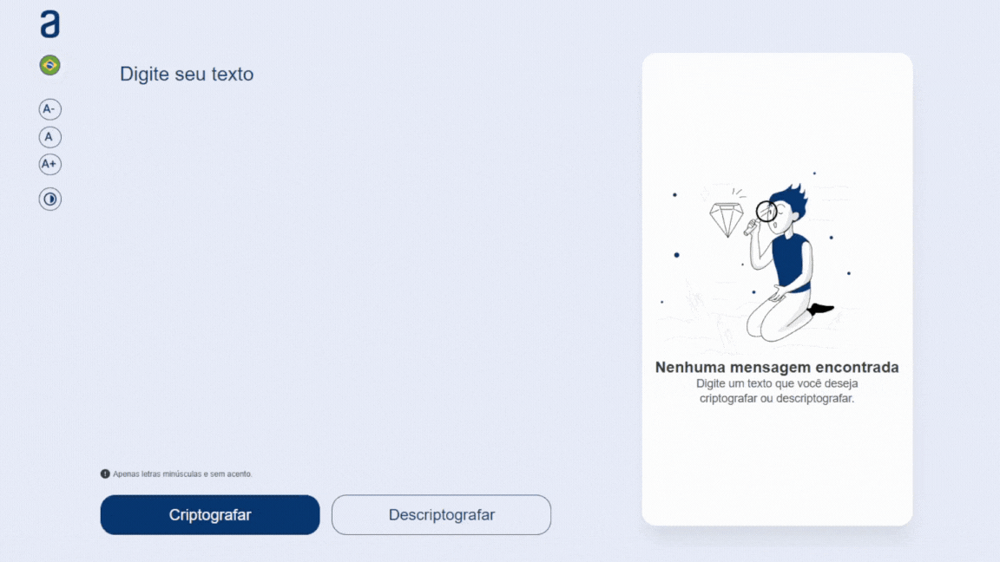
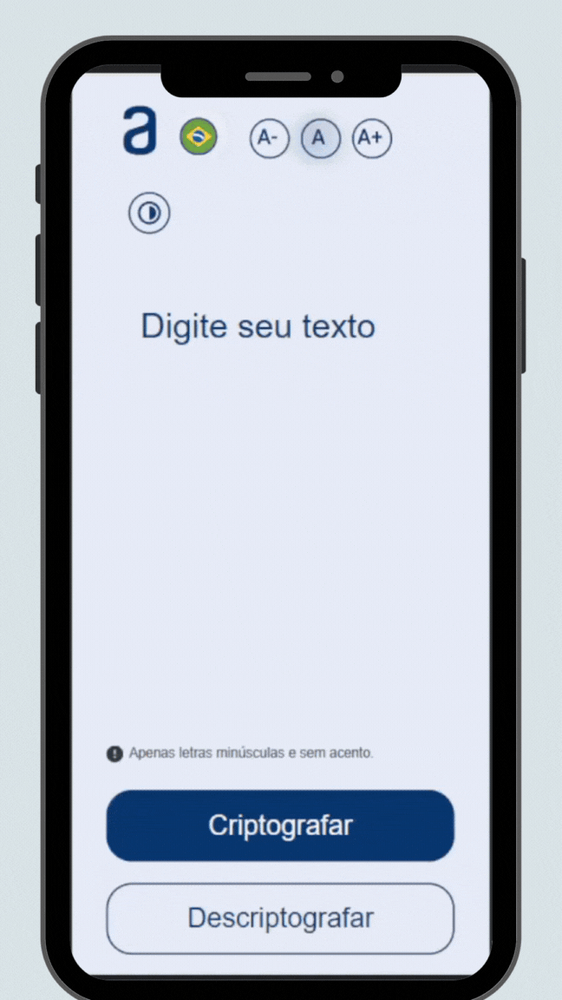

<h1 align="center">
    <strong>Challenge ONE Decodificador</strong>
</h1>

<p align="center">
    <apan align="center">
      
    </apan>
        <span align="center">
      
    </span>
</p>


## 🧪 Tecnologias

Esse projeto foi desenvolvido com as seguintes tecnologias:

- [HTML](https://developer.mozilla.org/pt-BR/docs/Web/HTML)
- [CSS](https://developer.mozilla.org/pt-BR/docs/Web/CSS)
- [JavaScript](https://developer.mozilla.org/pt-BR/docs/Web/JavaScript)

## 🚀 Como executar

Clone o projeto e acesse a pasta do mesmo.

```bash
$ git clone https://github/erikbernard/Challenge-ONE--Decodificado
$ cd Challenge-ONE--Decodificado
```

Para iniciá-lo, siga os passos abaixo:

```bash
# abra em um browser o arquivo index.html
```


## 💻 Projeto

Projeto dessevolvido durante o programa ONE basicamente é construir um decodificador de texto com Javascript seguindo as seguintes intruções para criar as "chaves" de criptografia que usado no projeto são:
- A letra "e" é convertida para "enter"
- A letra "i" é convertida para "imes"
- A letra "a" é convertida para "ai"
- A letra "o" é convertida para "ober"
- A letra "u" é convertida para "ufat"

Requisitos:
- Deve funcionar apenas com letras minúsculas
- Não devem ser utilizados letras com acentos nem caracteres especiais
- Deve ser possível converter uma palavra para a versão criptografada e também retornar uma palavra criptografada para a versão original.

Por exemplo:
```
"gato" => "gaitober"
gaitober" => "gato"
```

Este é um projeto desenvolvido durante o **Programa ONE - Oracle Next Education**.

## 🔖 Layout

Você pode visualizar o layout do projeto através do link abaixo:

- [Layout Web](https://www.figma.com/file/B8s0vyp6l2KuUgRZbEFwAg/Alura-Challenge---Desafio-1---L%C3%B3gica-(Copy)?node-id=2%3A213&t=7dWUBrNDVcR4r55w-1)

Lembrando que você precisa ter uma conta no [Figma](http://figma.com/).
## 📝 License

Esse projeto está sob a licença MIT. Veja o arquivo [LICENSE](LICENSE) para mais detalhes.
